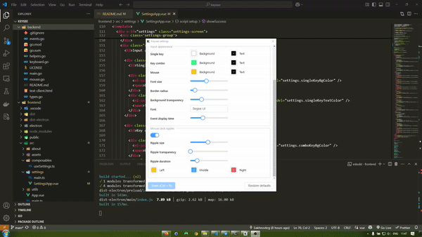

# Keysee

**Keysee** is a free and open-source tool for Windows that displays real-time keyboard and mouse input on screen. 

## Why use Keysee?

During tutorials or live demos, it's not always clear what keys or buttons are being used.
Keysee provides simple, clear input visuals without distracting from the main content.

## Features

- Displays keys, mouse buttons, and scroll events
- Filters out noise (like repeated keys)
- Detects combos (e.g. Ctrl + Shift + Z)
- Optional ripple effects for mouse clicks
- Customizable appearance
- Fully open source

## Notes
- Keysee is already functional and ready to use, but it's still under active development.
You may encounter minor issues — feedback is welcome!
- The relatively large file size is due to the app being built with Electron, which bundles a minimal browser engine to ensure consistent UI and behavior across systems.
- The app includes a backend component that communicates with the overlay via a local port (:12834).
This may trigger a firewall prompt on first launch.
- The connection is local-only and does not access the internet.
It's safe to allow the app through the firewall for full functionality
- Once launched, Keysee runs in the background and can be managed from the system tray.

## Download

[Windows](https://github.com/sakhnovkrg/keysee/releases)

## Contacts

## License

[MIT License](LICENSE)

## Project Structure

| Component  | Purpose                          | Tech Stack                               |
|------------|----------------------------------|------------------------------------------|
| `backend/` | Low-level input capture engine   |  |
| `frontend/`| Visual overlay application       |   |